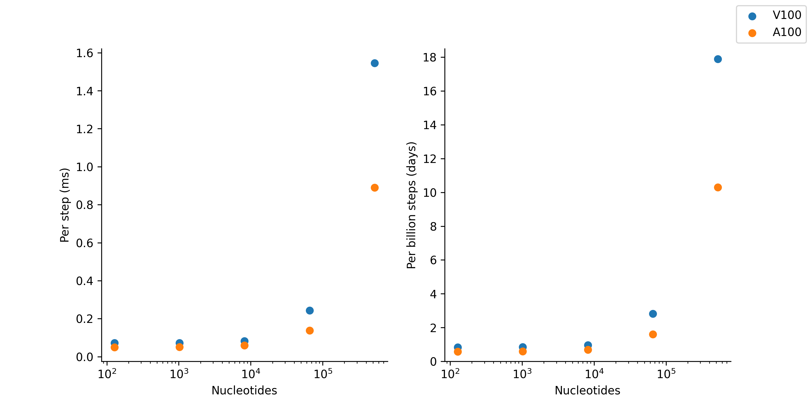

# Efficient GPU usage

## Simulation performance on GPU classes
As NVIDIA releases new GPU architectures, the performance of oxDNA generally increases.  On current hardware (June 2023), it is not uncommon to be able to run well-sampled equilibrium simulations of DNA origami structures within 1-2 days. The following graph compares the performace of NVIDIA v100 vs a100 scientific GPUs on oxDNA simulations of varying sizes.



This data was taken by Erik Poppleton on MPCDF Cobra (v100) and Raven (a100) in June 2023.

## Increasing simulation throughput with multi-process service
Compared with the AI applications that modern GPUs are optimized for, oxDNA simulations use relatively little memory.  This means that you can get significance increases in simulation throughput by activating [Multi-Process Service (MPS)](https://docs.nvidia.com/deploy/mps/index.html), an alternative CUDA API which allows multiple processes to share the same GPU.  If your cluster is MPS compatible (GPUs set to EXCLUSIVE_PROCESS, preferably Volta architecture or newer), using oxDNA is as simple as:

```bash
nvidia-cuda-mps-control -d
for i in $(seq 1 $nproc); do
    cd r$i
    /u/epoppleton/software/oxDNA/build/bin/oxDNA input &
    sleep 0.25
    cd ..
done
wait
echo quit | nvidia-cuda-mps-control
```

It is generally advisable to include the `sleep` between starting each oxDNA process as if they start too close together, the memory allocation on the GPU will occasionally fail.

The following graph compares the performance of various numbers of MPS processes on 80GB v100 and a100 GPUs with various number of processes


This data was taken by Erik Poppleton on MPCDF Cobra (v100) and Raven (a100) in June 2023.

**NOTE** The largest system size (524288 nucleotides) ran out of memory after 10 processes, this is why there's no change at 20 and 40 processes on a100s and no data on v100s.

**NOTE** Some variation in the data was caused by a few jobs per-batch failing due to too many members in the neighbor list.  This can be avoided by adding the [max_density_multiplier](https://lorenzo-rovigatti.github.io/oxDNA/input.html#cuda-options) argument to the input files; however this increases memory usage and may cause the MPS runs with higher numbers of replicates to fail.

**NOTE** The clusters used to test here limited the number of CPUs associated with each GPU to 20 (v100) and 16 (a100), this likely impacted the simulation efficiency for large numbers of processes.

CSV format files for these graphs can be found here: [v100](images/scaling/v100.csv) | [a100](images/scaling/a100.csv)

If you would like to test this on your own cluster, the setup files can be found on [Erik's GitHub](https://github.com/ErikPoppleton/oxDNA_performance).
